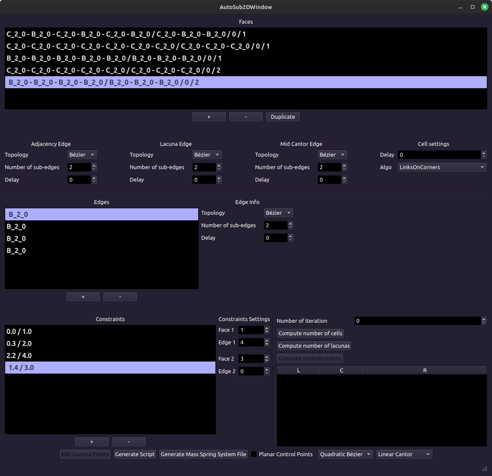
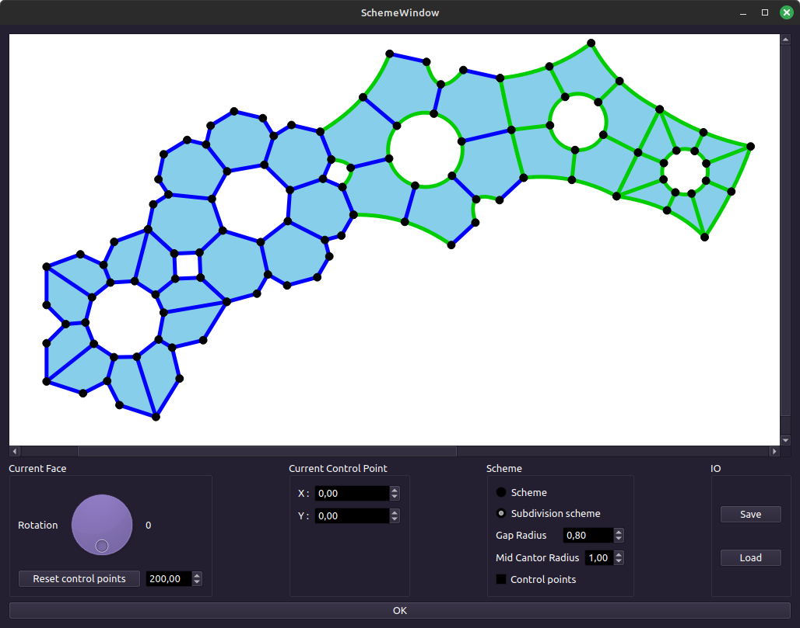
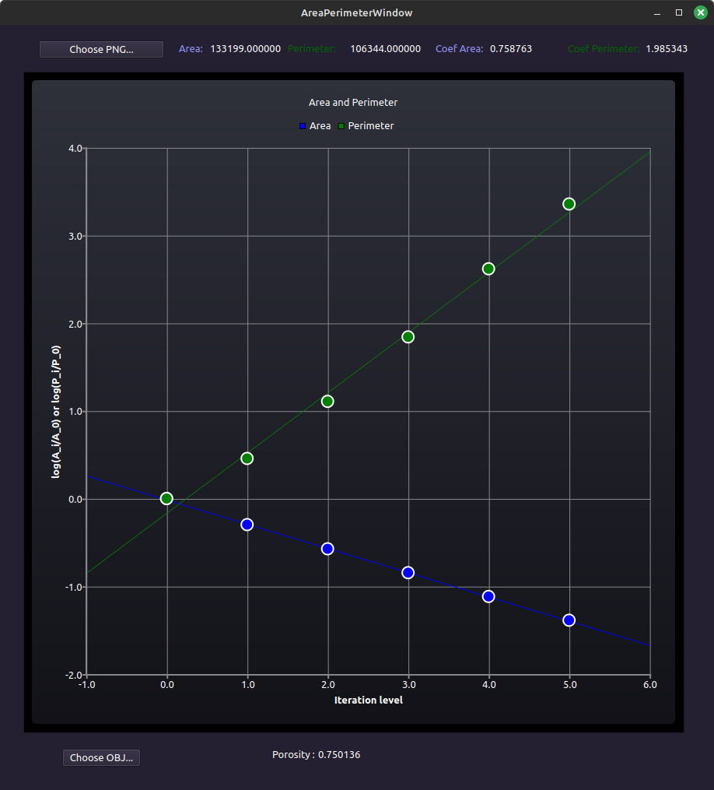

# AutoFrac

Software to help conception of fractals and study fractal properties.  
The main workflow is to produce a Python file, with this software, containing the topologic description of a fractal.
The fractal modeler [MODITERE](https://sourcesup.renater.fr/projects/moditere/) is needed to interpret the Python file and visualize the fractal.

## How to build
 
Replace the `{path_to_Qt6}` with the path to Qt. Be sure to have Qt6 installed.  
Replace `{NB_CORES}` by the number of cores to use to compile the project.

```bash
git clone https://github.com/borisbordeaux/AutoFrac.git
cd AutoFrac
mkdir build
cd build
export QT_PATH={path_to_Qt6}/gcc_64
cmake -DCMAKE_BUILD_TYPE=Release ..
make -j {NB_CORES}
```

For an integration within an IDE, be sure to set the `QT_PATH` environment variable for the project.

## Main features

Main features are separated in several parts, each with its own GUI.
The following content of this file describes the main functionalities implemented on each part. 

### Fractal conception from their boundary

This software allows to conceive fractal faces by describing the fractal behavior of their edges.
See [[1]](#1) for more theoretical information on how it is done.



Eventually, it is possible to force the faces to be constrained in a 2D plane, allowing to edit control points position.
The edition is made in a separate window, in which it is possible to view the subdivision scheme.




Finally, the fractal can be exported in a Python file, which is the input of the fractal modeler MODITERE.
Here are some fractals conceived by this software.


### Fractal conception from polyhedron circle packings

This software also allows to conceive fractals using polyhedron circle packings [[2]](#2).
Such packings need a polyhedron, which can be imported as an OBJ file.
It is possible to visualize the packing, on the plane or directly on the sphere.

Mettre images interface polyèdre et empilement associé (plan et sphère).


The main idea is to extract the topology of the fractal structure of such packings.
The associated fractal of the polyhedron can be automatically exported in a Python file, which is the input of the fractal modeler MODITERE.


### Measures for fractals 

This software proposes some measures on fractal structures in the form of OBJ files or images.

#### Compute the Fractal Dimension

Compute fractal dimension using the box counting method [[3]](#3) on an image.


#### Compute the Area and Perimeter

Compute the area and the perimeter of an image or an OBJ file.
In this context, the perimeter is the total length of edges separating the interior and the exterior of the structure.



#### Compute the Density

Compute the density of a structure on an image et displays for each pixel its density (normalized or not).


#### Compute the Persistent Homology

Compute the persistent homology of a structure defined in an OBJ file and display the persistent cohomology diagram.


## References

<a id="1">[1]</a>
Boris Bordeaux and Christian Gentil.
Automatic construction of fractal structures with locally controlled lacunarity.
Journal of WSCG, 32(1-2):1–12, 2024.

<a id="2">[2]</a>
Iván Rasskin.
Regular polytopes, sphere packings and apollonian sections.
Geometriae Dedicata, 218(6):105, 2024.

<a id="3">[3]</a>
Kenneth Falconer.
Fractal geometry : mathematical foundations and applications.
John Wiley & Sons, 2013.